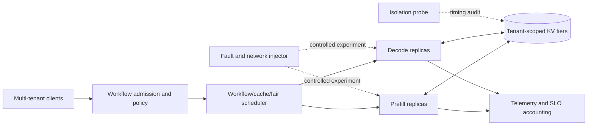

# AegisServe

[](https://github.com/shivam2003-dev/secure-multi-agent-llm-serving/actions/workflows/ci.yml)
[](LICENSE)
[](docs/RESEARCH_PLAN.md)

**A research benchmark and systems prototype for secure, efficient multi-agent LLM
serving across distributed cloud environments.**

AegisServe studies a specific systems question: can an inference scheduler exploit
multi-agent workflow structure, batching, speculative decoding, and KV reuse while
preserving tenant isolation and recovering predictably from failures?

The repository does not publish unmeasured speedup claims. It provides the benchmark
contract, runnable trace generator and replay client, security and resilience metrics,
experiment configurations, and a source-grounded white paper needed to produce those
results reproducibly.

## Why multi-agent serving is different

A multi-agent application creates dependent LLM calls rather than an independent request
stream. A supervisor may unlock several workers, an aggregator sits on the critical path,
and agents reuse system prompts, tools, and conversation state. A scheduler that ignores
the workflow DAG may improve token throughput while making the user-visible workflow slower.



## Benchmark dimensions

| Dimension | Controlled mechanisms | Primary measures |
|---|---|---|
| Speculative decoding | off, draft model, speculative-token count | acceptance ratio, TPOT, throughput, quality parity |
| Batching | static/continuous, concurrency, token budget | queue delay, TTFT, batch occupancy, goodput |
| KV caching | off, prefix cache, GPU/CPU/remote tiers | hit ratio, TTFT, transfer bytes, eviction/recompute |
| Resource scheduling | round robin, affinity, workflow/cache/fair | workflow p95/p99, SLO attainment, Jain fairness |
| Failure recovery | replica crash, node loss, network delay | RTO, lost work, completion rate, duplicate output |
| Multi-tenancy and security | no isolation, tenant partition, keyed tenant salt | cross-tenant hits, timing AUC, noisy-neighbor slowdown |

The full definitions, controls, and run order are in
[the benchmark specification](docs/BENCHMARK_SPEC.md).

## Quick start

Prerequisites: Python 3.11 or newer and [uv](https://docs.astral.sh/uv/).

```bash
uv sync --extra dev --extra paper
uv run aegisbench validate configs/benchmark.quick.yaml
uv run aegisbench generate configs/benchmark.quick.yaml --output results/trace.jsonl
uv run pytest
```

Replay the generated DAG against one or more OpenAI-compatible inference endpoints:

```bash
export AEGIS_CACHE_SALT_SECRET='set-a-random-local-experiment-secret'
uv run aegisbench run configs/benchmark.quick.yaml \
  --trace results/trace.jsonl \
  --output results/events.jsonl
uv run aegisbench summarize results/events.jsonl \
  --output results/summary.json
```

`AEGIS_CACHE_SALT_SECRET` is HMACed with the tenant identifier. Never commit it. If the
serving engine does not accept a `cache_salt` request field, use per-tenant cache instances
or an adapter that preserves the same isolation invariant.

## What is implemented

- strict YAML configuration validation and a stable configuration digest;
- deterministic sequential, fan-out/fan-in, and multi-round debate traces;
- Poisson and bursty arrivals with uniform or Zipf tenant mixes;
- dependency-aware asynchronous replay to OpenAI-compatible servers;
- TTFT, TPOT, request throughput, workflow latency, cache, speculation, recovery,
  isolation, and fairness aggregation;
- cross-tenant cache timing audit with an attacker AUC gate;
- experiment and results templates that separate observed evidence from hypotheses;
- a rendered [white paper](output/pdf/aegisserve-whitepaper.pdf) and its
  [reviewable source](docs/WHITEPAPER.md).

Fault injection and engine-level speculative/KV counters are adapter points in v0.1.
The live replay client never kills infrastructure. The planned Kubernetes/Ray adapters
must make each mutation explicit and log the exact fault time and target.

## Proposed systems contribution

The proposed policy, **Workflow-Cache-Fair (WCF)**, ranks ready agent calls using:

1. remaining workflow critical-path slack;
2. tenant deficit relative to a weighted fair share;
3. expected KV locality benefit;
4. prefill/decode pressure and failure-domain health.

The central hypothesis is not that every optimization always helps. It is that a joint
policy can raise SLO goodput under bursty multi-agent load while bounding isolation,
fairness, and recovery costs. The [research plan](docs/RESEARCH_PLAN.md) defines falsifiable
hypotheses and ablations.

## Repository map

```text
configs/                 Reproducible quick and main-study configurations
docs/                    Architecture, threat model, protocol, and white-paper source
output/pdf/              Rendered white paper
scripts/                 White-paper build and verification tooling
src/aegisbench/          Trace, replay, metric, and security-audit implementation
tests/                   Unit and contract tests
```

## Research integrity

All numerical claims in the literature review are attributed to their original papers.
The proposed system has no claimed performance result until a run manifest, raw event log,
hardware inventory, software versions, and analysis output are published together. See
[REPRODUCIBILITY.md](docs/REPRODUCIBILITY.md).

## Contributing and citation

Issues and focused pull requests are welcome. Start with [CONTRIBUTING.md](CONTRIBUTING.md),
report vulnerabilities using [SECURITY.md](SECURITY.md), and cite the project using
[CITATION.cff](CITATION.cff).

## License

Apache License 2.0. Research-paper citations remain subject to their original terms.
