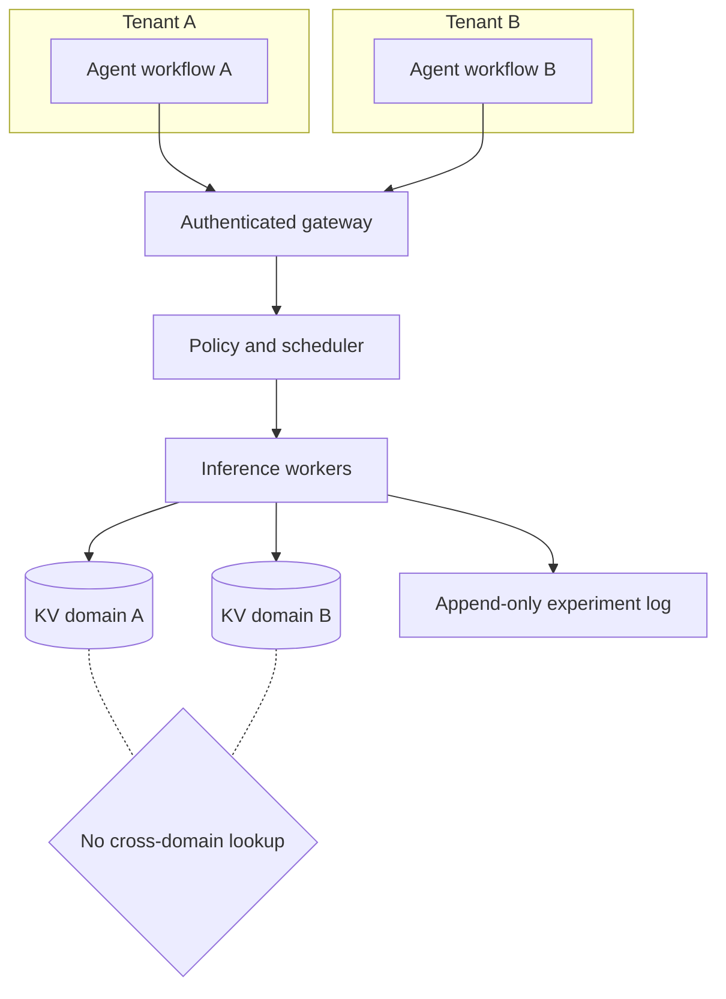

# Architecture

## Design objective

AegisServe treats a multi-agent application as a tenant-owned directed acyclic graph (DAG)
of inference requests. Admission, scheduling, cache placement, and recovery operate on both
request-level and workflow-level state. This avoids equating maximum token throughput with
minimum end-to-end task latency.

## Logical components

### 1. Workflow admission controller

The controller accepts a DAG and attaches immutable metadata: workflow and tenant IDs,
security domain, dependencies, prompt/output budgets, deadline, and priority class. It
rejects malformed graphs and enforces per-tenant admission limits before GPU work begins.

### 2. Ready queue and WCF scheduler

Only nodes whose dependencies are complete enter the ready queue. The proposed
Workflow-Cache-Fair score is:

```text
score(r) = a * criticality(r)
         + b * tenant_deficit(r)
         + c * cache_locality(r)
         - d * service_cost(r)
         - e * failure_risk(target)
         - f * endpoint_load(target)
```

The coefficients are validated configuration parameters, not learned constants. The client
reference implementation combines remaining critical-path work, deadline urgency, fan-out,
and terminal-node status into criticality. Tenant deficit tracks admitted token work.
Cache locality is a predictor based on successful prior placement, not a measured cache hit.
Failure risk and endpoint load react to observed client outcomes and active admissions.

The scheduler is work-conserving: when capacity is available, it scores every waiting
request/endpoint pair and admits the highest score with stable trace-order tie breaking.
Round-robin and tenant-affinity use the same ready-queue and concurrency boundary.

### 3. Inference workers

Workers expose an OpenAI-compatible streaming API and may use vLLM, SGLang, or another
engine. The reference protocol records prefill and decode metrics separately. Prefill/decode
disaggregation is an experimental factor, not a required deployment shape.

### 4. Tenant-scoped KV manager

KV entries belong to a security domain. The strict policy uses an unpredictable keyed
tenant salt in the prefix-cache key. Public, explicitly shareable prefixes may use a
separate public domain, but private-to-public promotion is never automatic. Remote cache
movement must use authenticated encryption and integrity checks.

### 5. Recovery coordinator

The coordinator records request metadata and, for selected treatments, incremental KV
checkpoints. On failure it chooses one of three recovery modes: recompute the prompt,
restore a checkpoint, or resume from a replicated KV state. The result log records detection,
restart, first-token-after-recovery, duplicate-token, and workflow completion events.

### 6. Evidence plane

Client-observed timestamps are authoritative for TTFT and workflow latency. Engine metrics
provide batch, KV, and speculation details. Infrastructure telemetry supplies GPU, network,
and fault timing. Every event carries a run ID, config digest, workflow ID, tenant ID, and
request ID. The generated manifest binds the config, trace, event file, Git state, treatment,
and runtime with hashes without recording API keys, cache secrets, or prompt bodies.

## Trust boundaries



## v0.2 implementation boundary

The repository currently implements configuration, strict DAG validation, DAG-aware client
replay with round-robin, tenant-affinity, and WCF admission, coverage-aware metric/SLO
aggregation, timing-isolation analysis, and run manifests. WCF acts before the endpoint; it
does not control engine batch composition. Cache movement, engine counters, and fault
injection remain specified interfaces awaiting cluster adapters. A local client cannot
truthfully claim GPU scheduler behavior or recovery without engine and infrastructure
evidence.
